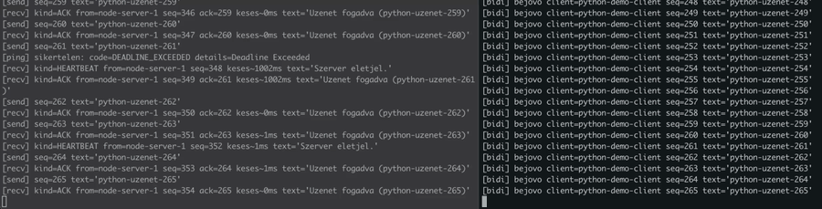

# gRPC demo: Node.js szerver + Python kliens

Ez a projekt egy egyszeru, de valos gRPC kommunikaciot mutat be egy Node.js szerver es egy Python alkalmazas kozott.

## Mit demonstral?

- **Interoperabilitas**: ket kulonbozo nyelv ugyanarra a `.proto` szerzodesre epul.
- **Gyors, binaris protokoll**: Protobuf serialization.
- **Bidirectional streaming**: a Python kliens kuld uzeneteket, a Node.js szerver pedig ACK + heartbeat uzeneteket kuld vissza ugyanazon streamen.
- **Ujrakapcsolodas**: a Python kliens automatikusan ujraprobal csatlakozni, ha a szerver leall vagy ujraindul.
- **Kombinalt RPC mintak**: unary (`Ping`), server-stream (`SubscribeTicks`) es stream-stream (`ChatStream`).

## Projekt struktura

- `proto/demo.proto` - kozos szerzodes (service + uzenetek)
- `node-server/server.js` - gRPC Node.js szerver
- `python-client/client.py` - gRPC Python kliens (bidirectional stream + reconnect)
- `python-client/generate_stubs.py` - Python stub generalas

## Elofeltetelek

- Node.js 18+
- Python 3.10+

## Futtatas (2 kulon terminal)

### 1. Terminal - Node.js szerver

```bash
cd node-server
npm install
npm start
```

Alapertelmezett cim: `localhost:50051`

### 2. Terminal - Python kliens

```bash
python3 -m venv python-client/.venv
source python-client/.venv/bin/activate
pip install -r python-client/requirements.txt
python python-client/generate_stubs.py
python python-client/client.py --target localhost:50051
```

## Ujrakapcsolodas demo

1. Inditsd el mindket alkalmazast.
2. A Node.js szervert allitsd le (`Ctrl+C`).
3. Nezd meg, hogy a Python kliens hibara fut, majd exponencialis visszalepessel ujracsatlakozast probal.
4. Inditsd ujra a Node.js szervert (`npm start`).
5. A Python kliens automatikusan ujra kapcsolodik es ujranyitja a bidirectional streamet.

## Mit latsz futas kozben?

- `[send]` sorok: a Python kliens periodikusan kuld client oldali uzeneteket.
- `[recv] kind=ACK ...` sorok: a Node.js szerver visszaigazolja a fogadott kliens uzeneteket.
- `[recv] kind=HEARTBEAT ...` sorok: a szerver onalloan is kuld adatot, tehat mindket oldal aktiv kuldo.
- `[ping]` sorok: minden 5. ACK utan unary hivas is megy, hogy latszodjon a tobbi RPC tipus is.

## Screen recording



Eredeti video: [communication.mov](./communication.mov)

## Miert jo ez a minta?

- A szerzodes-elsobb fejlesztes miatt a ket alkalmazas lazan csatolt.
- Bidirectional streaminggel valodi ketiranyu, allando kapcsolatot kapsz polling helyett.
- A beallitott reconnect opciok es ujraproba ciklus robusztussa teszi a kliens viselkedeset atmeneti kiesesnel is.
